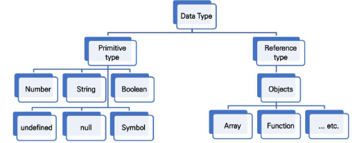

# Javascript01

## 220425

## 변수와 식별자

### 1. 식별자(identifier)의 정의와 특징

- 식별자 === 변수명
  - identifier is the name of a variable which can seperate it from the others.
- 식별자는 반드시 문자, 달러 또는 밑줄로 시작
  - identifier begins with character, dollar sign($), or underscore(_)
- 식별자는 대소문자를 구분하며, 클래스명 외에는 모두 소문자로 시작
  - distinguishes letter cases, and all begins with lower case with exception of class name.
- 예약어 사용 불가능
  - reserved word cannot be identifier eg) `for`, `if`, `funciton` etc

### 2. 식별자 작성 스타일

|                          종류                           |      설명, 사용처       |
| :-----------------------------------------------------: | :---------------------: |
|    카멜 케이스(camel**C**ase, **lower**-camel-case)     | 변수, 객체, 함수에 사용 |
| 파스칼 케이스(**P**ascal**C**ase, **upper**-camel-case) |  클래스, 생성자에 사용  |
|         대문자 스네이크 케이스(SNAKE**_**CASE)          |  상수(constant)에 사용  |

### 3. 변수 선언 키워드

|               Let               |                Const                 |
| :-----------------------------: | :----------------------------------: |
| 재할당 예정인 변수 선언 시 사용 | 재할당 예정이 없는 변수 선언 시 사용 |
|       변수 재선언 불가능        |          변수 재선언 불가능          |
|           블록 스코프           |             블록 스코프              |

### 4. 선언, 할당, 초기화

- 선언: 변수를 생성하는 행위 또는 시점
- 할당: 선언된 변수에 값을 저장하는 행위 또는 시점
- 초기화: 선언한 변수에 처음으로 값을 저장하는 행위 또는 시점

### 5. 블록 스코프

- `if`, `for`, 함수 등의 중괄호 내부를 가리킨다. 
- 블록 스코프를 가지는 변수는 블록 바깥에서 접근할 수 없다.

### 6. `var` 변수

- 재선언과 재할당이 모두 가능하다
- ES6 표준 이전 변수 선언 시 사용하던 키워드
- 호이스팅으로 인해 예기치 못한 문제가 발생할 수 있다.
  - 따라서 ES06부터는 `const` 와 `let`의 사용을 권장
- 함수 스코프

## 자료형(Data Type)

### 1. 데이터 타입 종류

- 크게 **원시** 타입(Primitive Type)과 **참조** 타입(Reference Type)으로 구분한다.

|              원시타입               |              참조타입               |
| :---------------------------------: | :---------------------------------: |
|        객체가 아닌 기본 타입        |         객체 타입의 자료형          |
|    변수에 해당 타입의 값이 담김     |  변수에 해당 객체의 참조값이 담김   |
| 다른 변수에 복사시 실제 값이 복사됨 | 다른 변수에 복사시 참조 값이 복사됨 |

### 2. 원시타입

#### 2-1 숫자타입

